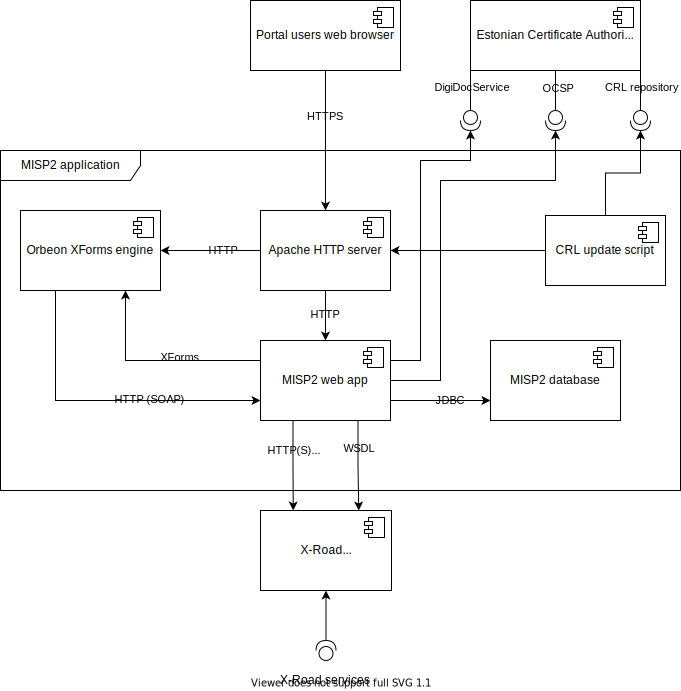
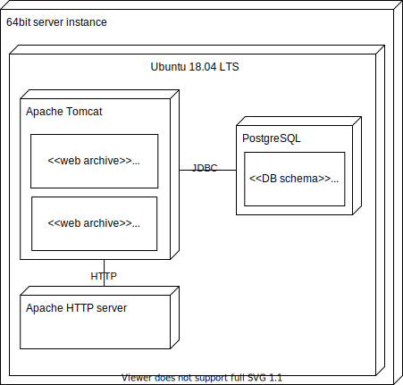

|  |
| -------------------------: |

# MISP2 Architecture

Version: 1.10

## Version history <!-- omit in toc -->

 Date       | Version | Description                                                     | Author
 ---------- | ------- | --------------------------------------------------------------- | --------------------
 10.06.2021 | 1.10    | Convert from Word to Markdown                                   | Raido Kaju

## License <!-- omit in toc -->

This document is licensed under the Creative Commons Attribution-ShareAlike 4.0 International License.
To view a copy of this license, visit <https://creativecommons.org/licenses/by-sa/4.0/>

## Table of content <!-- omit in toc -->

* [1. Introduction](#1-introduction)
* [2. Background](#2-background)
* [3. MISP2 component diagram](#3-misp2-component-diagram)
  * [3.1 MISP2 webapp](#31-misp2-webapp)
    * [3.1.1 Using X-Road services in MISP2](#311-using-x-road-services-in-misp2)
  * [3.2 The Orbeon XForms engine](#32-the-orbeon-xforms-engine)
  * [3.3 The Apache HTTP server](#33-the-apache-http-server)
  * [3.4 The MISP2 database](#34-the-misp2-database)
  * [3.5 The X-Road Security Server](#35-the-x-road-security-server)
  * [CRL update script](#crl-update-script)
* [4 Installation diagram](#4-installation-diagram)
* [5 External interfaces](#5-external-interfaces)
  * [5.1 Connection to the X-Road Security Server](#51-connection-to-the-x-road-security-server)
  * [5.2 Loading WSDL descriptions](#52-loading-wsdl-descriptions)
  * [5.3 Connection to the Estonian SK CA services](#53-connection-to-the-estonian-sk-ca-services)
    * [5.3.1 OCSP](#531-ocsp)
    * [5.3.2 CRL](#532-crl)
    * [5.3.3 DigidocService](#533-digidocservice)
* [6 Technology overview](#6-technology-overview)

## 1. Introduction

This document describes the architrecture of the X-Road MISP2 portal. It
contains a description of the components and connectors as well as giving an
overview of the operation of MISP2 in the context of X-Road.

## 2. Background

The MISP2 portal is a pre-made X-Road component, that allows a user to generate
and take into use user interfaces for X-Road services, without the need to
develop special software. The target usergroup for MISP2 are the institutions
that need to start using X-Road services, but for who it is unefficient to
develop support for X-Road in their existing software solutions.

* The standard components of MISP2 are:
  * The MISP2 webapp
  * The Orbeon XForms engine
  * The MISP2 database
  * The Apache HTTP server
  * Apache Tomcat

## 3. MISP2 component diagram

The component diagram shows the components of MISP2 as well as their connections
and the connections with third party software.

### 3.1 MISP2 webapp

The main function of the webapp is to server as the main place to generate and
use user interfaces based on X-Road services as well as handling authentication
and user rights management.

The MISP2 webapp is realised as the following web interfaces:

* The portal, which is accessible by regular users to access X-Road services
* The management portal for managing access rights as well as generating and
  managing the web forms. A more detailed description can be found in the [MISP2
  manager guide](./misp2_manager_guide.md)

#### 3.1.1 Using X-Road services in MISP2

In the following section, we describe how calling an X-Road service uses the
different MISP2 components.

1. Authenticating the MISP2 user

   Authentication can be done it the following ways:
   * Using a username and password
   * Using a client certificate in the browser
   * Using the Estonian ID-card or Mobile-ID
2. The user chooses a list of services from a list
3. The portal queries the database and displays a list of services based on the
   user group the authenticated user belongs to
4. The user chooses (searches) a service from the X-Road service catalogue to
   run a simple/complex X-Road service
5. The portals web application:
   1. Queries the database for the XForms for associated with the service
   2. Queries the database for the XLS transformations associated with the
      specific service or globally and applies them in the orter of priority to
      the XForms form
   3. Provides the resulting XForms form as the input for the portals XForms
      engine
6. The XForms engine generates the input form for the simple/complex service in
   HTML and returns in to the users browser
7. The user enters the required data to the HTML form and clicks a button to
   execute the query (in some instances the service starts automatically without
   requireing any input)
8. The XForms engine starts a `submission`, which forwards the SOAP request
   described by the XForms input form to the MISP2 `mediator-servlet`
9. The `mediator-servlet` fills the standard fields of the request (eg the
   institution), with the users data
10. The `mediator-servlet` forwards the X-Road request to the configured X-Road
    Security Server
11. The X-Road Security Server returns the response to the `mediator-servlet`
12. The `mediator-servlet` returns the response to the XForms engine
13. The XForms engine generates an output form for the service in HTML
14. (If it is a complex service) The data is passed to the next subservice.
    Depending on the logic of the complex service one of the following happens:
    1. The request is forwared to the next subservice and the process moves back
       to the 6th step
    2. The complex service ends here

### 3.2 The Orbeon XForms engine

MISP2 uses the XForms standard in order to define input and output forms for
X-Road services. The XForms standard describes both the service data structure
(as SOAP) and the user interface that is bound to it. MISP2 uses the Orbeon
XForms engine (currently version 4.9CE) for this functionality.

Orbeon Forms is a standalone JAVA web application, that is integrated into the
MISP2 installation package. The MISP2 web application shares user sessions with
the Orbeon application. When filling in the XForms forms, the browser
communicates directly with the Orbeon application rather than going through the
MISP2 web application.

Orbeon Forms creates the SOAP requests as well as the HTML forms based on the
XForms description. The XForms descriptions can automatically be generated by a
portal manager, using the built in XForms generator in MISP2.

### 3.3 The Apache HTTP server

The Apache HTTP server plays a role in managing access rights and user access in
cases where the Estonian ID-card based authentication is used. It also acts as
the HTTPS terminator, proxying the client requests to the MISP2 application in
the backend. In the Estonian ID-card based authentication case it also forwards
the ID-card certificate information to the backend.

### 3.4 The MISP2 database

The database system in use for MISP2 is PostgreSQL, and it contains the
following data:

* Information about the portals users and their groups
* Metadata about X-Road producers
* Metadata about services, including generated XForms and XSL stylesheets
* Information about query access rights

### 3.5 The X-Road Security Server

The organisations Security Server that is used by the MISP2 application to
communicate with the X-Road network.

### CRL update script

This is only relevant for users of the Estonian ID-card based authentication.
The script checks the CRL list inside the Apache HTTP server at certain
intervals against the one provided in the CA-s CRL repository and updates as
required.

## 4 Installation diagram

## 5 External interfaces

The following headings describe MISP2-s connections with external systems.

### 5.1 Connection to the X-Road Security Server

The X-Road Security Server is used by MISP2 to send requests over the X-Road
network. The following X-Road message protocols are supported. Only version 4.0
is officially supported.

### 5.2 Loading WSDL descriptions

MISP2 uses the WSDL-s provided by X-Road producers in order to automatically
generated XForms descriptions for the services. To do this, the WSDL is
downloaded, an XForms description is generated for the selected services and the
results stored inside the PostgreSQL database. MISP2 does not store any of the
WSDL-s it downloads.

The WSDL can be downloaded from the configured X-Road Security Server
automatically or by providing a valid URL for the WSDL manually. Only
`document/literal` style WSDL-s are officially supported.

### 5.3 Connection to the Estonian SK CA services

This is only relevant for users that have configured the Estonian ID-card or
mobile-ID based authentication.

#### 5.3.1 OCSP

This is used to check the state of the authentication certificate if it has been
enabled in the configuration.

#### 5.3.2 CRL

This is used to dowload the revocation lists if it has been enabled in the
configuration.

#### 5.3.3 DigidocService

This is used to authenticate users with the mobile-ID.

## 6 Technology overview

The following table provides an overview of the technologies used by the
different components.

|                      |JAVA 8|PostgreSQL|Apache HTTP|Apache Tomcat|
|----------------------|------|----------|-----------|-------------|
| Web app              | x    |          | x         | x           |
| Database             |      | x        |           |             |
| Orbeon XForms engine | x    |          |           | x           |
